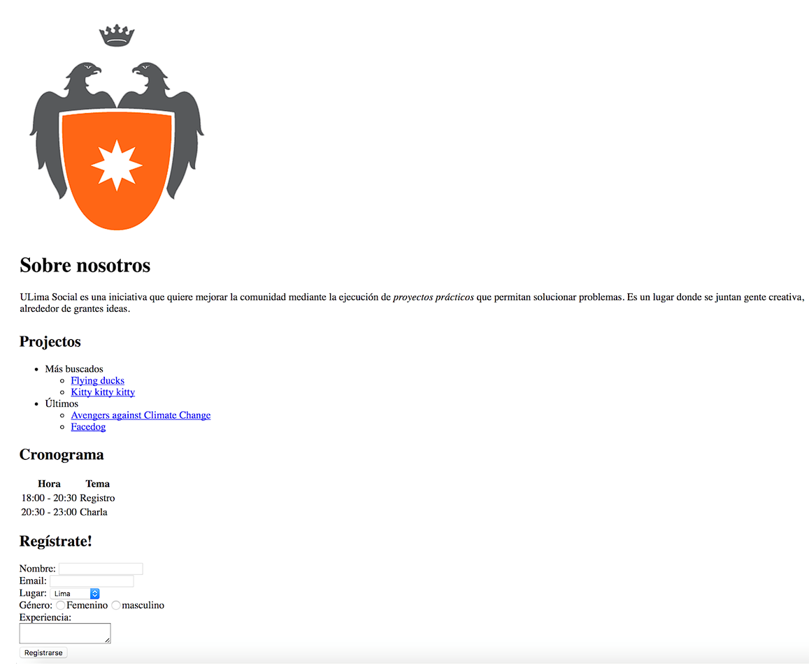

# 1. Ejercicio con HTML y CSS

Para este ejercicio, debe crear un archivo **index.html** y **estilos.css**. En este ejercicio, deberá de utilizar lo visto con HTML y CSS. Para esto debe de implementar la siguiente página:

Tomar en cuenta:

- Los links de los proyectos deben de apuntar a sí mismo.
- La url del logo de la universidad es el siguiente: https://upload.wikimedia.org/wikipedia/commons/0/0e/ULIMA_logo.png
- Los lugares pueden ser Lima y Arequipa.
- En los radio Femenino y Masculino, solamente se puede seleccionar uno a la vez (investigar).

