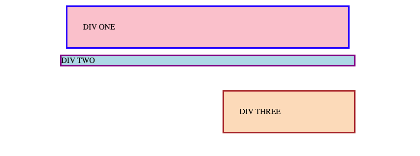
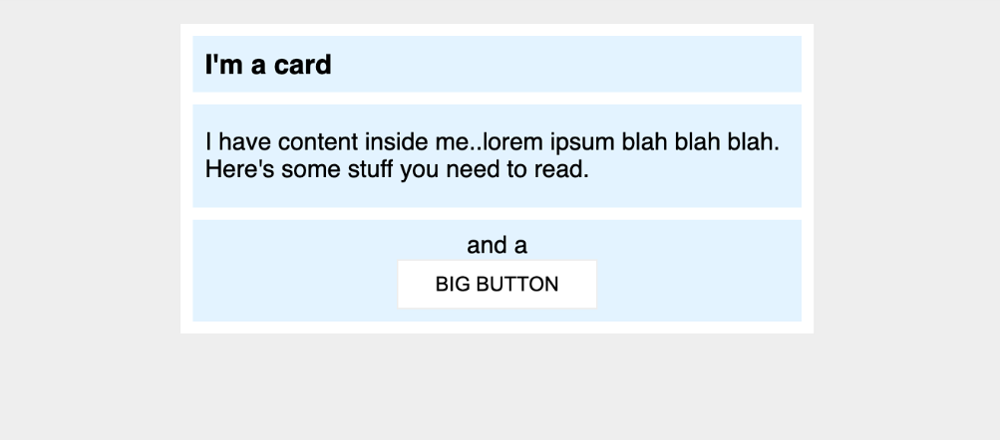

# Ejercicios de Margin y Padding

## Ejercicio 1

Debe crear la siguiente página utilizando css externo (ejercicio1.html y estilos1.css).

Tomar en cuenta lo siguiente:

- **DIV ONE** y **DIV THREE** tienen 32px entre el texto y el borde.
- **DIV ONE** tiene 12px con cualquier elemento de la página.
- Hay 48px de distancia entre **DIV TWO** y **DIV THREE**.
- **DIV THREE** está alineado a la derecha. Para este alineamiento solo puede utilizar margin.

## Ejercicio 2

Debe crear la siguiente página utilizando css externo (ejercicio2.html y estilos2.css).

Tomar en cuenta lo siguiente:

- Hay 8px entre el borde del card (el card es la parte blanca) y su contenido.
- Hay 8px de distancia entre cada una de las secciones azules dentro del card.
- El título del card utiliza 16px de tamaño de letra.
- Hay 8px entre el texto del título y el borde de la sección del título.
- La sección central tiene 16px de espacio hacia arriba y abajo, y 8px hacia los costados.
- Todo dentro de la sección de abajo está centrado y tiene 8px de padding.
- El botón tiene 24px de espacio a los lados y 8px hacia los costados.
