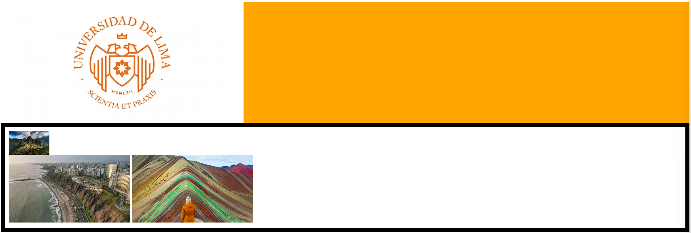

# Ejercicios de Selectors

Para estos ejercicios deber'as utilizar selectores de clase, identificador o elemento.

## Ejercicio 1

Crear una pagina html llamada ejercicio1.html y una hoja de estilos estilos1.css. En esta página debes de crear dos botones que se vean de la siguiente manera:

Tomar en cuenta:

- El primer elemento tiene un fondo negro y texto en blanco.
- El segundo elemento un fondo de color amarillo.
- Los dos elementos tienen tamaño de letra 28px y una lista de fonts Helvetica, Times New Roman y sans-serif.
- Debe crear por lo menos 3 clases.

## Ejercicio 2

Tambien puede encadenar selectores. De esta forma, estos filtrarán (seleccionarán) los elementos de manera consecutiva.

Tomar en cuenta:

- El div top debe tener un fondo naranja.
- El div contenido debe tener un borde negro de ancho 10px además de tener un padding de 10px para todos los lados (utilizar una clase).
- En el div contenido, la primera imagen (MachuPicchu) debe tener ancho de 100px.
- Las imágenes de Lima y del Montaña de 7 colores deben de tener un ancho de 300px.
