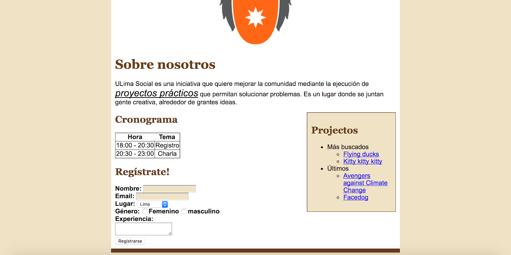

# Ejercicios con bootstrap

## Ejercicio 1

## Ejercicio 2

Se le pide modificar lo realizado en el módulo 1 (html) ahora utilizando el sistema de grillas de bootstrap.

Tomar en cuenta:

- El logo de la universidad debe de estar centrado.
- El tipo de letra es Arial y el color de fondo de la página es #EFE1C6
- El color de los textos de h1 y h2 es #66401A y su tipo de letra es Georgia.
- Para la parte del párrafo subrayada, el tamaño de la letra es 1.5 veces el tamaño normal.
- Las etiquetas del formulario son negrita y los input de nombre y email deben de tener color de fondo #EFE1C6.
- El área central debe de tener 700px de ancho, ser de colog blanco y un border inferior de 10px y color #66401A. Además debe de tener un padding de 10px para todos los lados.
- El área de proyectos debe de estar en la parte derecha, ser de 200px de ancho con color #EFE1C6. Además debe de tener 10px de padding y el border ser de 1px con color #66401A.