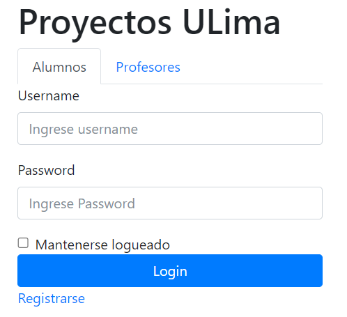
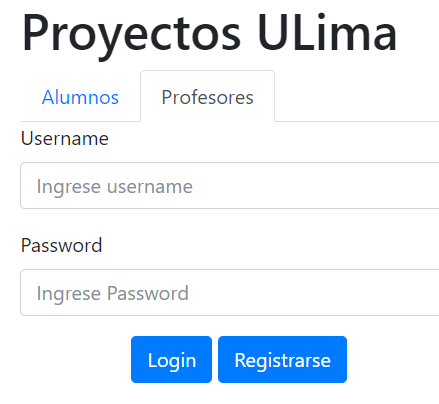

# Ejercicios con bootstrap - Forms

## Ejercicio 1

Se le pide implementar la siguiente página utilizando bootstrap.

Debe de permitir el cambio al hacer click en el tab de profesores mostrando el siguiente formulario.

