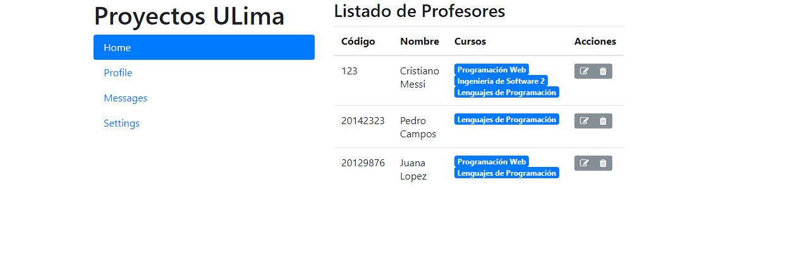

# Ejercicios con bootstrap - Tablas

## Ejercicio 1

Implementar la siguiente pagina utilizando Bootstrap.

Tomar en cuenta:

- Para los íconos, puede utilizar la biblioteca de bootstrap.
- Debe utilizar listas para la parte izquierda del menú.