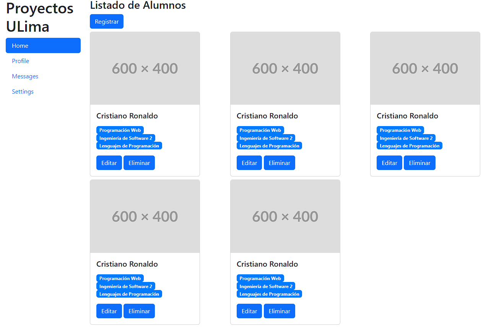

# Ejercicios con bootstrap - Cards

## Ejercicio 1

Implementar la siguiente página utilizando bootstrap.

Para las imágenes, puede utilizar los placeholders de la siguiente página: https://placehold.co/
