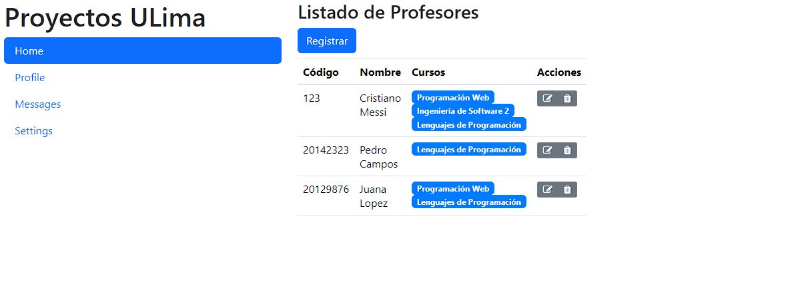
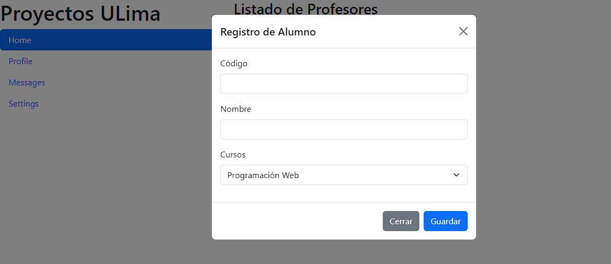

# Ejercicios con bootstrap - Modal

## Ejercicio 1

Crear una pantalla modal donde se puedan registrar los datos de un alumno.

Agregar un botón a la página hecha en la sección 6 llamado "Registrar".

Luego al hacer click en el botón, deberá abrir la siguiente pantalla Modal.

